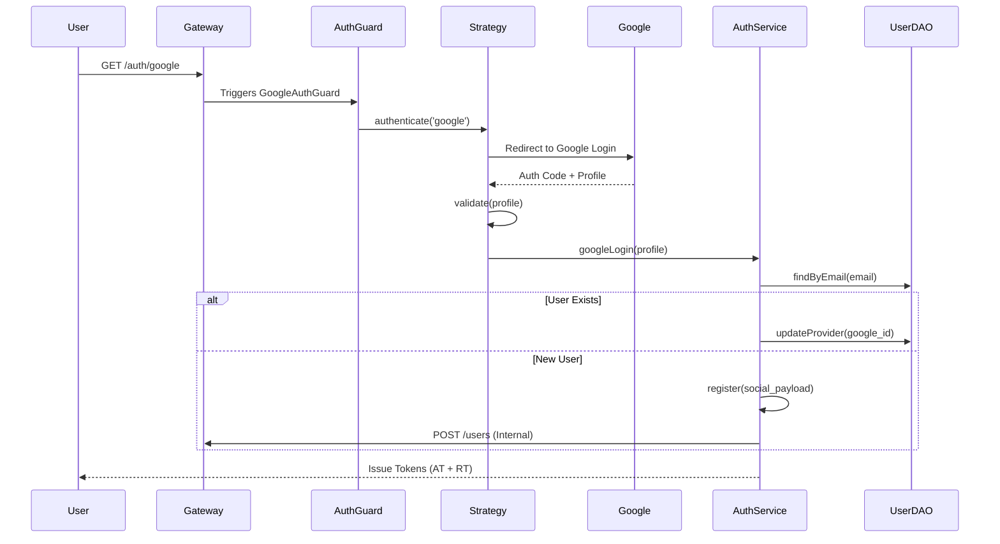

# Social Login Architecture (OAuth2)

This document describes the technical implementation and code structure of the Google Social Login flow within the Auth and User microservices.

## High-Level Flow

## Technical Breakdown

### 1. The Entry & Guard
**File**: `apps/auth/src/modules/auth/guards/google-auth.guard.ts`
**Code**: `export class GoogleAuthGuard extends AuthGuard('google') {}`
- **Purpose**: A standard NestJS guard that triggers the Passport `google` strategy. Attached to the `/auth/google` and `/auth/google/callback` endpoints.

### 2. The Strategy
**File**: `apps/auth/src/modules/auth/strategies/google.strategy.ts`
- **Logic**:
  - Extends `PassportStrategy(Strategy, 'google')`.
  - Configures `clientID`, `clientSecret`, and `callbackURL`.
  - Scopes: `email`, `profile`.
  - **`validate()` Method**: Normalizes the raw Google profile into a standard object containing `email`, `firstName`, `lastName`, and `providerId`.

### 3. The Orchestrator (Service)
**File**: `apps/auth/src/modules/auth/auth.service.ts`
- **Method**: `googleLogin(googleProfile, res)`
- **Logic**:
  1. Checks if a user already exists with that email in `auth_db`.
  2. If user exists but was only "local", it updates their record sets the `provider` to `google` (Account Linking).
  3. If user doesn't exist, it calls `this.register()` which creates the entry in `auth_db` and triggers a downstream call to the **User Service** to create their profile.
  4. Generates a stateful **Access Token** (stored in Redis) and a **Refresh Token** (stored in Postgres + Cookie).

### 4. The Endpoints (Controller)
**File**: `apps/auth/src/modules/auth/auth.controller.ts`
- **GET `/auth/google`**: Redirects to Google.
- **GET `/auth/google/callback`**: Receives the profile from the strategy (ready in `req.user`) and calls `authService.googleLogin()`.

## Data Consistency
The system uses a **Compensation Pattern** during social registration. If the Auth record is created but the call to the User Service profile creation fails, the Auth record is deleted to prevent orphaned accounts.
