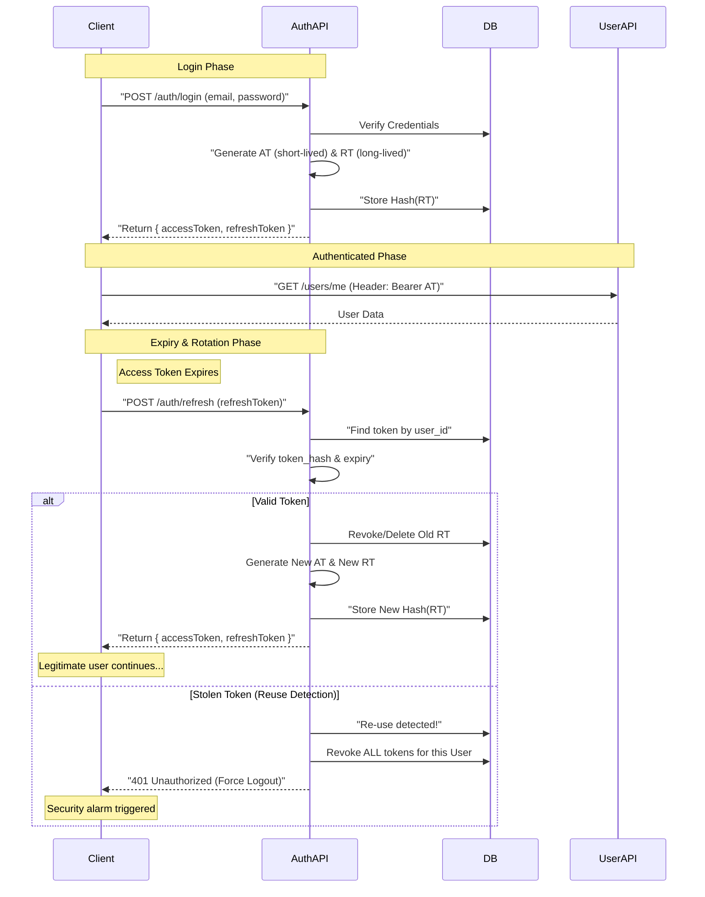

# Token & Session Management

This document defines the security architecture for user sessions using JWT Access Tokens and Refresh Token Rotation.

## 1. Design Philosophy
Minimal window of exposure for stolen tokens while providing a seamless user experience (zero logout).

## 2. Sequence Diagram

## 3. Implementation Details

### Access Token (AT)
- **Format**: JWT (Stateless)
- **Life**: 15 Minutes
- **Payload**: `{ id: string, email: string }`

### Refresh Token (RT)
- **Format**: Random String (Opaque)
- **Life**: 7 Days
- **Storage (Server)**: Hashed in `refresh_tokens` table.
- **Storage (Client)**: **HTTP-Only, Secure, SameSite=Lax** Cookie.
- **Utilities**: Managed via `@app/common` in `cookie.utils.ts`.
- **Rotation**: On every refresh, a new RT is issued and the old one is deleted.

## 4. Key Security Features
- **XSS Protection**: By using `httpOnly: true`, the Refresh Token cannot be accessed by JavaScript, preventing theft via XSS.
- **SECURE Flag**: Cookies are only sent over HTTPS (in production).
- **One-time use**: Once a Refresh Token is used, it is dead.
- **Breach Detection**: If an attacker uses a token that was already used (stolen), all sessions for that user are revoked immediately.
