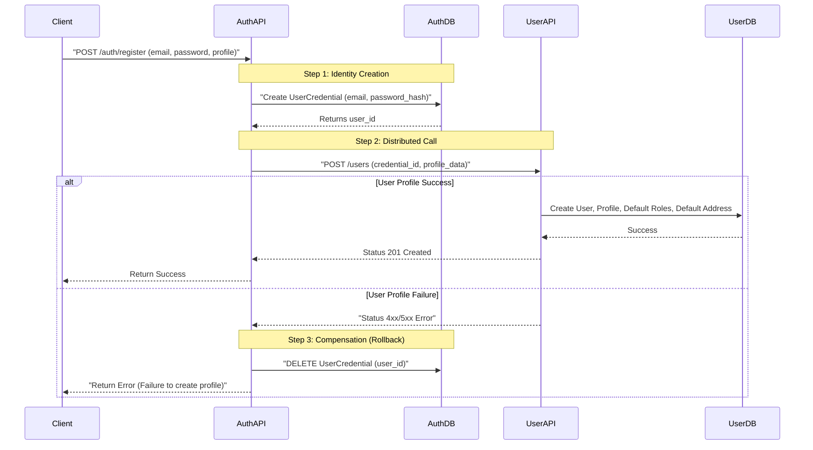

# Distributed User Registration

This document explains the orchestration flow between the **Auth Service** and **User Service** during the registration process.

## 1. Distributed Logic Flow
Since the system uses separate databases for Auth (credentials) and User (profiles), we use an orchestration pattern with a compensation (rollback) mechanism.

## 2. Component Breakdown

### Auth Service Responsibility
- Creating and managing the password hash.
- Orchestrating the call to the User Service.
- Handling the rollback if the User Service is down or validation fails.

### User Service Responsibility
- Managing the **UserProfile** (name, phone, avatar).
- Managing **UserAddresses**.
- Assigning the initial **UserRole** (e.g., 'customer').

## 3. Database Schema Mapping
- **Auth Database**: `user_credentials` table (Primary Key: `user_id`).
- **User Database**: `users` table (Primary Key: `id`).
- **Linking**: The `users.credential_id` in the User DB stores the `user_id` from the Auth DB.

## 4. API Interface (UX Context)
The client sends one single request to `/auth/register`. 
- **Internal Error Handling**: The client doesn't see the internal complexity. If the profile creation fails, they get a 500 error, and no stale account is left in the system.
